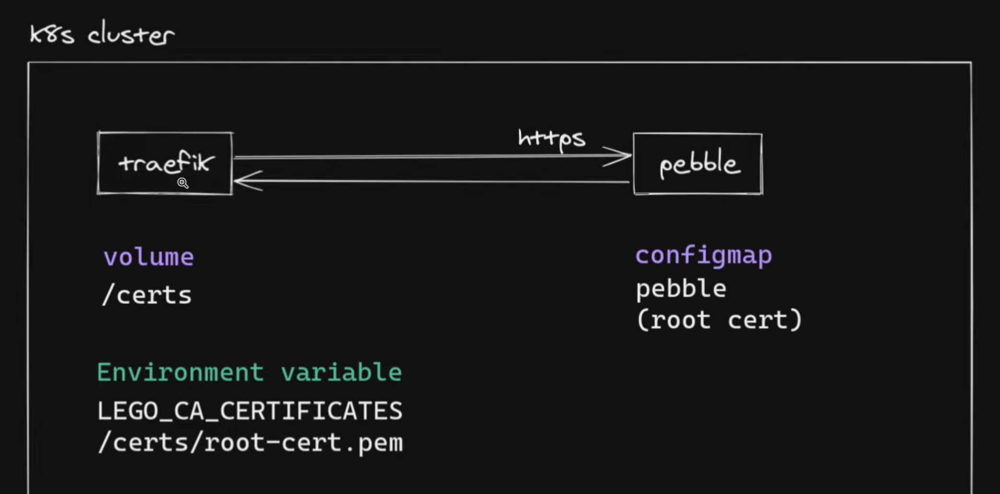

# Part 1 | Prerequisite

### [Step 1] Provision a k8s cluster - using vagrant
Folder vagrant-provisioning
```
cd vagrant-provisioning
vagrant up
```

### [Step 2] Deploy load balancing solution - metallb

* Installation guid [MetalLB](https://metallb.universe.tf/installation/#installation-by-manifest)

* define and deploy a [configmap](https://metallb.universe.tf/configuration/#layer-2-configuration) _(don`t fogot change addresses)_

> More info about MetalLB in lesson [Kube 33.1] 

### [Step 3] Make sure metallb works as expected

```
k create deploy nginx --image nginx
k expose deploy nginx --port 80 --type LoadBalancer
```

After checkout, delete 
```
k delete deploy nginx
k delete svc nginx
```

### [Step 4] Setup dynamic storage provisioning - nfs

* Deploy dynamic NFS provisioning

```
k get sc
# nfs-client
```

> More info about NFS in lesson [Kube 23.1] 

### [Step 5] Install Traefik by Helm chart

[Helm Chart](https://doc.traefik.io/traefik/getting-started/install-traefik/#use-the-helm-chart)

Modify traefik values
```
helm show values traefik/traefik > /tmp/traefik-values.yaml

persistence:
  enabled: true
  name: data
  accessMode: ReadWriteOnce
  size: 128Mi
  path: /data
  annotations: {}
```
Install traefik
```
helm install traefik traefik/traefik --values /tmp/traefik-values.yaml -n traefik --create-namespace
```
Check traefik UI
```
k -n traefik port-forward traefik-*** 9000:9000
```

# Part 2 | Creating IngressRoutes

Create deployments
```
cd ingress-demo
k apply -f nginx-deploy-main.yaml -f nginx-deploy-green.yaml -f nginx-deploy-blue.yaml
```
Make expose
```
k expose deploy nginx-deploy-main --port 80
k expose deploy nginx-deploy-blue --port 80
k expose deploy nginx-deploy-green --port 80
```
Paste Traefik LoadBalancer IP in `/etc/hosts`
```
vi /etc/hosts
172.16.16.240  nginx.example.com
```

### [Step 1] Simple IngressRoutes

Create IngressRoute
```
k apply -f ingress-demo/traefik/simple-ingress-routes/1-ingressroute.yaml
```
Delete simple IngressRoutes
```
delete ingressroute nginx
```

- Example 3 explain how create multiple routes
- Example 4 with Headers
- - `curl -H "FROM: test@example.com" nginx.example.com`
- Example 5 with Headers Regexp
- Example 6 explain how use || and &&

> More Examples in [Kubernetes IngressRoute](https://doc.traefik.io/traefik/routing/providers/kubernetes-crd/)

# Part 3 | Dealing with TLS certificates

_We use local kubernetes cluster like Vagrant, and /etc/hosts for DNS, there we can`t use external internet like AWS Route 53 to check Let's encrypt._

_However we can use Pebble_



### [Step 1] Deploy Pebble to k8s

Take installation guids from [Github](https://github.com/jupyterhub/pebble-helm-chart)

Modify pebble values
```
helm show values jupyterhub/pebble > /tmp/pebble-values.yaml

env:
  # uncomment this env, only fof local cluster, with out DNS like Route53
  - name: PEBBLE_VA_ALWAYS_VALID
    value: "1"

coredns:
  enabled: false
```

Install pebble
```
helm install pebble jupyterhub/pebble --values /tmp/pebble-values.yaml -n traefik
```

Look cm
```
k -n traefik get cm pebble -o yaml
```

### [Step 2] Update Traefik Helm values file

vim `/tmp/traefik-values.yaml`

```
persistence:
  enabled: true
  name: data
  accessMode: ReadWriteOnce
  size: 128Mi
  path: /data
  annotations: {}

additionalArguments:
  - --certificatesresolvers.pebble.acme.tlschallenge=true
  - --certificatesresolvers.pebble.acme.email=test@hello.com
  - --certificatesresolvers.pebble.acme.storage=/data/acme.json
  - --certificatesresolvers.pebble.acme.caserver=https://pebble/dir

volumes:
  - name: pebble
    mountPath: "/certs"
    type: configMap

env:
  - name: LEGO_CA_CERTIFICATES
    value: "/certs/root-cert.pem"
```

- Upgrade Traefik helm release
- Examples in `ingress-demo/traefik/tls-ingress-routes` folder

Check TLS in Traefik UI

```
k -n traefik port-forward traefik-*** 9000:9000
```

# Part 4 | Exploring Middlewares

Examples in `ingress-demo/traefik/middlewares` folder

- Add Prefix
- Strip Prefix
- Redirect Scheme
