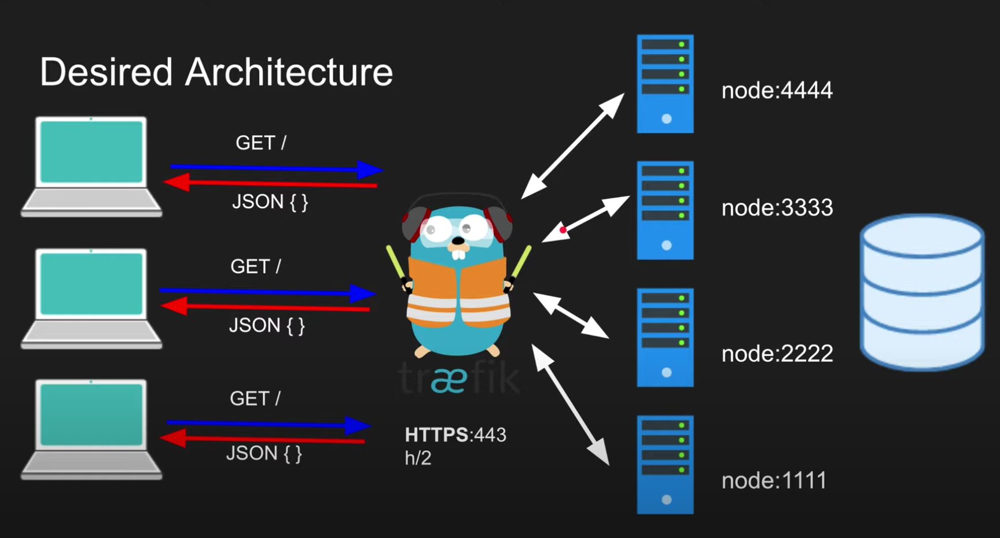

# Traefik example for vm

### Traefik architecture

- Traefik starts with static config which points to the dynamic config
- Entrypoints binds to ip/address
- Service defines backend
- Routers maps entrypoint to services through rules
- Middlewares are optional

### Emample
- Install Traefik
- Layer 7 Proxying
- - Proxy to 4 Backends
- - Conditional app1 app2
- - Prevent admin access
- - Weighred Round Robin
- Layer 4 Proxying 
- Enable HTTPS on Traefik
- Disable TLS 1.0/1.1

**Install [traefik](https://doc.traefik.io/traefik/getting-started/install-traefik/)**

Run traefik `traefik`

- all.yaml _all request to one service_
- split.yaml _split by path_
- blockadmin.yaml _block page by path_
- wrr.yaml _round robin balancer_
- tcp.yaml _L4 layer_
- - `curl http://telmanmac/`

> Create dummy domain for tls.yaml testing

1. Go to [noip.com](https://www.noip.com/)
2. Create account
3. Need public IP
4. Create Hostname `traefikdemo.ddns.net`

> Site [ssllabs.com](https://www.ssllabs.com/ssltest) help testing our ssl certificates

